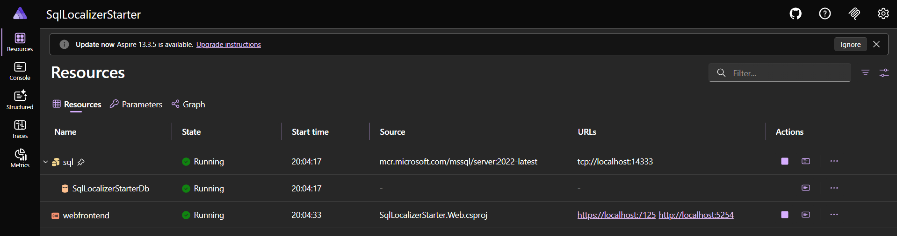
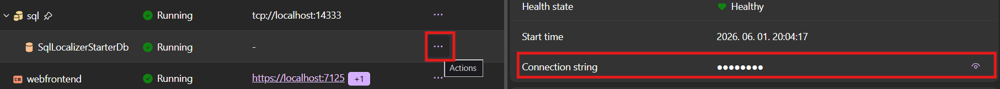
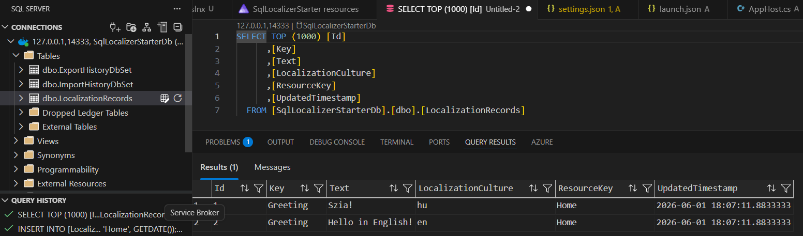
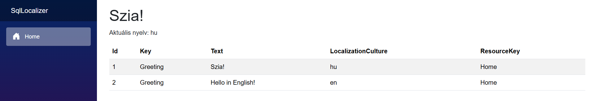
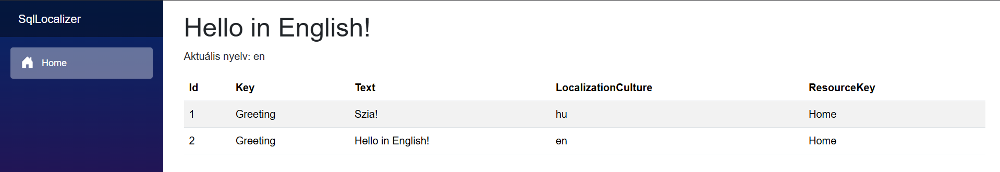

# SqlLocalizerStarter
Ez a Blazor app bemutatja, hogyan tudsz több nyelven megjeleníteni webes tartalmat. Böngésző nyelvi beállításoktól függően magyar/angol nyelvet választhatsz.

### Project követelmények
- .NET 10 SDK
- Docker (Aspire dockerrel működik)
- Aspire CLI (opcionális)

### Komponensek
- SQL Server (14333as port)
- Blazor WebApp



### Konfiguráció
Néhány dolgot elő kell készíteni:

#### 1. AppHostnak meg kell adni egy jelszót az SQL Serverhez
Ezt a secretet újra kell generáltatni (ha nincs, akkor csak indítsd el a projectet, generál egyet `SqlLocalizerStarter.AppHost.csproj` szerint)
```xml
<PropertyGroup>
  <UserSecretsId>fa50a785-d7ac-426a-8403-5199611d61fc</UserSecretsId>
</PropertyGroup>
```

Mivel az SQL Server jelszavát AppHost secretként adtam meg, az AppHost mappában kell beállítani
```bash
cd ./SqlLocalizerStarter.AppHost
dotnet user-secrets init
dotnet user-secrets set "Parameters:sql-password" "P@ssw0rd"
dotnet user-secrets list # check
```
A secret fájlod (`C:\Users\User\AppData\Roaming\Microsoft\UserSecrets\fa50a785-d7ac-426a-8403-5199611d61fc` `secrets.json`) valahogy így fog kinézni 
```json
{
  "Parameters:sql-password": "P@ssw0rd",
  "Aspire:VersionCheck:LastCheckDate": "2026-06-01T16:17:39.2798249\u002B00:00",
  "Aspire:VersionCheck:KnownLatestVersion": "13.3.5",
  "AppHost:OtlpApiKey": "c980d9fa284d429b0564d9774145e1d0",
  "AppHost:McpApiKey": "5f6ec6a98755bb24159d1d2f54c4045d",
  "AppHost:DashboardApiKey": "bd49eabff46bee39c77584a8d774798e"
}
```
Itt található az connectionstring, ha valami nem pont úgy van mint kellene


### Indító parancsok
Innen letölthető az Aspire CLI https://aspire.dev/get-started/install-cli/ 

Az Aspire dashboardot ezzel indítod el
```bash
aspire run
```
Ezzel a paranccsal indítod el ha VSben nem indul az AppHost
```bash
cd ./SqlLocalizerStarter.AppHost
dotnet run
```

### Példa tábla feltöltéséhez
Miután fut már az app:
`dbInitializer.sql` fájlban ezzel a paranccsal töltöd fel:
```sql
INSERT INTO [LocalizationRecords] ([Key], [Text], [LocalizationCulture], [ResourceKey], [UpdatedTimestamp])
VALUES 
('Greeting', 'Szia!', 'hu', 'Home', GETDATE()),
('Greeting', 'Hello in English!', 'en', 'Home', GETDATE());
```


### SqlLocalizerStarter.Web
Demo Blazor app elérhető https://localhost:7125/  

`Home.razor`
```razor
@inject IStringLocalizer<Home> L

<PageTitle>Home</PageTitle>

<h1>@L["Greeting"]</h1>
```


